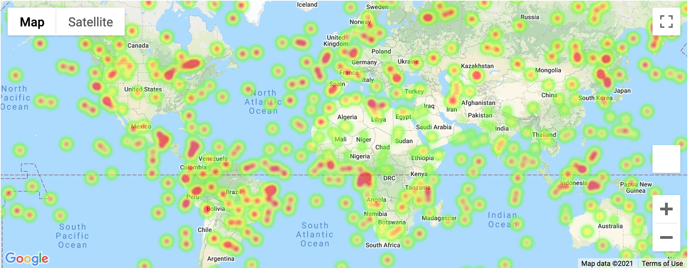
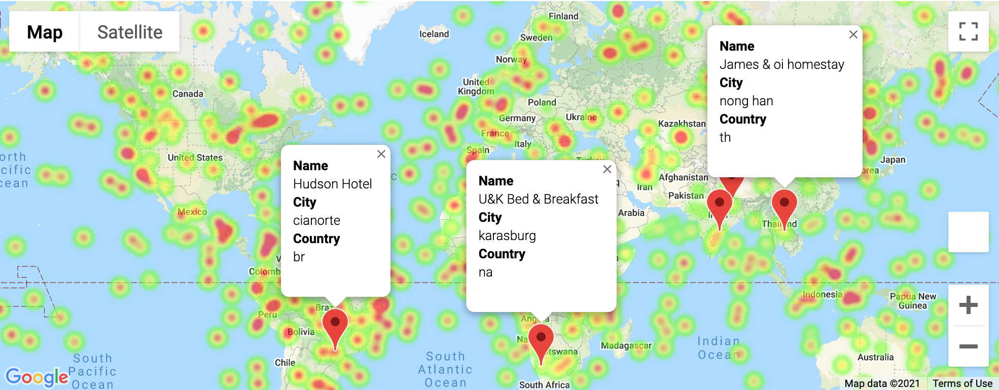

# Python API Challenge - What's the Weather Like?

## Task

To analyse weather data while considering the question: "What's the weather like as we approach the equator?". 

## Tools and Technologies

- Jupyter Notebook
- Python
- APIs
- Requests
- JSON

## Part I - WeatherPy

Created a Python script to visualise the weather of 500+ randomly selected cities across the world of varying distance from the equator. Utilised a [Python library](https://pypi.python.org/pypi/citipy),  and the [OpenWeatherMap API](https://openweathermap.org/api), to create a representative model of weather across world cities.

Created a series of scatter plots showcasing the following relationships:

* Temperature (F) vs. Latitude
* Humidity (%) vs. Latitude
* Cloudiness (%) vs. Latitude
* Wind Speed (mph) vs. Latitude

Accompanied each plot with an explanation of the code and an analysis.

Ran linear regression on each relationship after separating them into Northern Hemisphere (greater than or equal to 0 degrees latitude) and Southern Hemisphere (less than 0 degrees latitude):

* Northern Hemisphere - Temperature (F) vs. Latitude
* Southern Hemisphere - Temperature (F) vs. Latitude
* Northern Hemisphere - Humidity (%) vs. Latitude
* Southern Hemisphere - Humidity (%) vs. Latitude
* Northern Hemisphere - Cloudiness (%) vs. Latitude
* Southern Hemisphere - Cloudiness (%) vs. Latitude
* Northern Hemisphere - Wind Speed (mph) vs. Latitude
* Southern Hemisphere - Wind Speed (mph) vs. Latitude

Accompanied each pair of plots with an explanation of what the linear regression was modeling.

## Part II - VacationPy

Used jupyter-gmaps and the Google Places API to plan future vacations based on weather data.

* Created a heat map that displays the humidity for every city from the part I of the task.

  

* Narrowed down the DataFrame to find ideal weather conditions: 

  * A max temperature lower than 95 degrees but higher than 65.

  * Wind speed less than 18 mph.

  * Cloudiness less than 15.

* Used Google Places API to find the first hotel for each city located within 5000 meters of the coordinates.

* Plotted the hotels on top of the humidity heatmap with each pin containing the **Hotel Name**, **City**, and **Country**.

  

